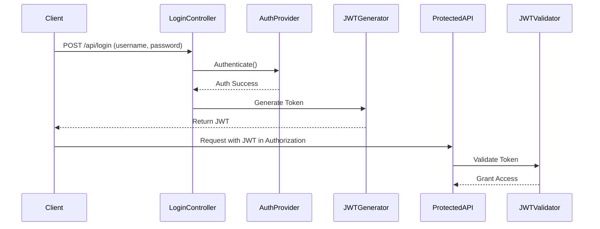

# 🔐 Employee Leave Management System (ELMS)


> A secure, stateless backend application for managing employee leave requests with **Spring Boot**, **JWT-based authentication**, and **custom login mechanism**. Designed for real-world scalability and clean architecture.

---

## 📚 Table of Contents

- [🚀 Overview](#-overview)
- [🎯 Features](#-features)
- [🏗️ Architecture](#-architecture)
- [🔐 Security Design](#-security-design)
- [🧪 Custom Login Flow](#-custom-login-flow)
- [🧩 Key Modules](#-key-modules)
- [📬 REST API Endpoints](#-rest-api-endpoints)
- [⚙️ Technologies Used](#-technologies-used)
- [🛠️ How to Run](#-how-to-run)
- [🧠 Design Patterns](#-design-patterns)
- [📖 Swagger UI & API Exploration](#-swagger-ui--api-exploration)
- [🌐 References](#-references)
- [🙌 Acknowledgements](#-acknowledgements)

---

## 🚀 Overview

The **Employee Leave Management System (ELMS)** is a backend service to manage employee leave requests with role-based access control. It uses **JWT tokens** for stateless security and a **custom login endpoint** instead of Spring's default form login.

- 🧍 Employees can apply for, view, and cancel leave requests.
- 👨‍💼 Admins can approve/reject leave requests.
- 🏗️ Built with layered architecture and modular security.

> **Built with ❤️ under the Hexvoid initiative.**

---

## 🎯 Features

✅ **Custom manual login** (`/api/login`)  
✅ **JWT generation & validation** (stateless, no session)  
✅ **Role-based access control** (`EMPLOYEE`, `ADMIN`)  
✅ **Leave request approval workflow**  
✅ **Method-level security** using `@PreAuthorize`, `@PostAuthorize`, `@PreFilter`, `@PostFilter`  
✅ **Clean, layered backend structure**  
✅ **Custom exception handling & filters**  
✅ **Java 17 + Spring Boot 3.x compatible**  

---

## 🏗️ Architecture

### Layers:

1. **Presentation Layer** (Controllers) 
2. **Business Layer** (Services) 
3. **Data Access Layer** (Repositories) 
4. **Database** (MySQL)

- Follows **loose coupling** and **layered architecture** principles.
- **Role-based access control** enforced via **Spring Security + JWT**.

---

## 🔐 Security Design

### Key Components in Security

| Component                                    | Description                                       |
|----------------------------------------------|---------------------------------------------------|
| `EmployeeCredentials`                        | Stores user login data                           |
| `EmployeeAuthorities`                        | Role/permission mappings                         |
| `LeaveRequests`                              | Leave request model                              |
| `EmployeeUserDetailsService`                 | Authenticates users from DB                      |
| `EmployeeUserNamePwdAuthenticationProvider`  | Custom login validator                            |
| `SecurityConfig`                             | JWT filter config                                |
| `SpringSecurityConfig`                       | Endpoint-level security rules                    |


- **Manual `/api/login` endpoint** for authentication.
- Uses **UsernamePasswordAuthenticationToken** and a custom provider.
- On success:
  - Generates and returns a **JWT token**.
- All secured APIs use filters to validate JWTs before access.

> 🧪 This implementation bypasses Spring’s default login and form handling.

---

## 🧪 Custom Login Flow

### 🔁 Flow Diagram



---

## 🧩 Key Modules

| Package          | Description                                         |
|------------------|-----------------------------------------------------|
| `controller`     | Handles REST APIs for Employees and Leave Requests |
| `entity`         | JPA Entities and Enums (Employee, LeaveRequest, Roles) |
| `security`       | JWT Config, Authentication Provider, Security Rules |
| `filter`         | JWT filter for incoming requests                   |
| `service`        | Business logic (leave flow, login auth, validations) |
| `dao`            | Spring Data JPA interfaces for DB access           |
| `exceptionhandler` | Centralized exception handling for all controllers |

---

## 📬 REST API Endpoints

### 🔐 Auth

| Method | Endpoint     | Description                  |
|--------|--------------|------------------------------|
| POST   | /api/login   | Authenticates and returns JWT|

### 👤 Employee Management

| Method | Endpoint             | Access Control                        |
|--------|----------------------|----------------------------------------|
| POST   | /api/employees       | `@PreFilter(...)`                      |
| GET    | /api/employees       | `@PreAuthorize("hasAuthority('VIEW')")`|
| GET    | /api/employees/{id}  | `@PostAuthorize("hasAuthority('VIEW')")`|
| PUT    | /api/employees/{id}  | `@PostFilter(...)`                     |
| DELETE | /api/employees/{id}  | Admin only                            |

### 📝 Leave Requests

| Method | Endpoint             | Access Control                          |
|--------|----------------------|------------------------------------------|
| POST   | /api/leaves          | Employee only                           |
| GET    | /api/leaves          | Admin only                              |
| GET    | /api/leaves/{id}     | Employee/Admin based on ownership       |
| PUT    | /api/leaves/{id}     | Admin only (approval/rejection)         |
| DELETE | /api/leaves/{id}     | Employee only (if pending)              |

---

## ⚙️ Technologies Used

- **Java 17**  
- **Spring Boot 3.1+**  
- **Spring Security**  
- **JWT (io.jsonwebtoken)**  
- **Maven**  
- **MySQL / H2** (configurable)  
- **Postman** (for API testing)  

---

## 🛠️ How to Run

Clone the repo:

```bash
git clone https://github.com/mHexVoid/elms-springboot-security-sandbox.git
cd elms-springboot-security-sandbox
```

Configure `application.properties` with your DB and JWT secret:

```properties
spring.datasource.url=jdbc:mysql://localhost:3306/employee_portal
jwt.secret=myjwtsecret
```

Run the app:

```bash
./mvnw spring-boot:run
```

Test `/api/login` with Postman, receive token, and call secured APIs.

---

## 🧠 Design Patterns

- **Strategy Pattern** for pluggable authentication  
- **Factory Pattern** for custom JWT filter setup  
- **Builder Pattern** ()  
- **Layered Architecture** enforcing SRP and SoC  
- **Loose Coupling** across layers using interfaces and DI  

---

## 📖 Swagger UI & API Exploration

**Swagger is available at:** 🌐 [http://localhost:8080/swagger-ui/index.html](http://localhost:8080/swagger-ui/index.html)


> Explore the full API documentation, test various endpoints, and get detailed responses from the system directly through the Swagger UI.

---

## 🌐 References

- **JWT**: [JWT.io](https://jwt.io/)
- **Spring Boot**: [Spring.io](https://spring.io/projects/spring-boot)
- **Spring Security**: [Spring Security](https://spring.io/projects/spring-security)
- **Swagger UI**: [Swagger.io](https://swagger.io/)

---


## 🙌 Acknowledgements

- Thanks to [Spring](https://spring.io/),
 [JWT.io](https://jwt.io/), and [OpenAPI](https://swagger.io/)
- Inspired by real-world security architecture and modular design principles.

---

## 👨‍💻 Author

**Gaurav Mishra** 
- 🧑‍💻 GitHub: [@mHexVoid](https://github.com/mHexVoid)  
- 🌐 Project Repo: [ELMS - Spring Security Sandbox](https://github.com/mHexVoid/elms-springboot-security-sandbox.git)  
- 💼 LinkedIn: [Gaurav Mishra](https://www.linkedin.com/in/gaurav-mishra-401a8a149/)

---

<p align="center">🚀 Built with ❤️ by <strong><a href="https://github.com/mHexVoid">Hexvoid</a></strong> — Part of the ✨ <strong>Hexvoid Initiative</strong> ✨</p>