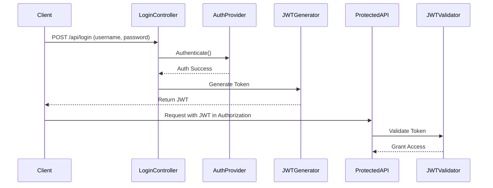

# 🔐 🛡️ Employee Leave Management System (ELMS)  
### Spring Security + JWT + Method-Level Authorization


## 📚 Table of Contents
- [🧠 Project Overview](#-project-overview)
- [🎯 Purpose](#-purpose)
- [📁 Project Structure](#-project-structure)
- [🔐 Security and Authentication](#-security-and-authentication)
- [🧪 Custom Login Flow Diagram](#-Custom-Login-Flow)
- [🧠 Custom Manual Login Flow](#-custom-manual-login-flow)
- [🛡️ Method-Level Security](#-method-level-security)
- [🧩 Key Components](#-key-components)
- [✅ Record Classes Explained](#-record-classes-explained)
- [🪄 Beans and Config](#-beans-and-config)
- [📦 Technologies Used](#-technologies-used)
- [🚀 How to Run](#-how-to-run)
- [📬 API Endpoints Summary](#-api-endpoints-summary)
- [🔎 Swagger UI](#-swagger-ui)
- [📚 References](#-references)
- [🙌 Acknowledgements](#-acknowledgements)

---

## 🧠 Project Overview
Welcome to the Employee Leave Management System – a backend system built using Spring Boot, Spring Security, and JWT with custom manual authentication.

This project is a secure, role-based portal for managing employee leave requests, tailored with custom login handling using JWT, without relying on Spring Security’s default login.

✅ Now enhanced with method-level authorization using:
- `@PreAuthorize`
- `@PostAuthorize`
- `@PreFilter`
- `@PostFilter`

---

## 🎯 Purpose
This project enables:
- Employees to request, view, update, or cancel leave requests.
- Admins/Managers to approve/reject requests.
- Role-based access using JWT, Spring Security, and method-level permissions.

---

## 📁 Project Structure
**Package:** `com.hexvoid.employeeportal`
- `controller`: Handles REST APIs (e.g., EmployeeController, LeaveRequestController)
- `dao`: Interfaces for DB interaction, secured with `@PreAuthorize`, `@PostAuthorize`
- `entity`: JPA entities + enums + record classes
- `events`: Event handling
- `exceptionhandler`: Global exception management
- `filter`: Custom filters like JWT processing
- `security`: Core Spring Security logic + configs
- `service`: Business logic

---

## 🔐 Security and Authentication
This project **does not** use Spring Boot's default login page.

Instead, it features:
- Custom manual authentication via `/api/login`
- Stateless JWT session management
- Role-based access using Spring Security + DB credentials

### 🔁 JWT Flow:
1. User sends credentials to `/api/login`
2. On success, receives a signed JWT token
3. Token used in headers for protected API access
4. JWT is validated via filter for every request

---

## 🧪 Custom Login Flow

### 🔁 Flow Diagram



---

## 🧠 Custom Manual Login Flow

- **Endpoint:** `POST /api/login`
- Accepts credentials as JSON
- Authenticates manually (no form login)
- If valid, generates and returns JWT

> Manual control ensures clean decoupled API-first design.

---

## 🛡️ Method-Level Security
Spring Security supports method-level security with annotations. This project uses:

| Annotation     | Usage Scope          | Description                                      |
|----------------|----------------------|--------------------------------------------------|
| `@PreAuthorize` | Before method        | Validates permissions before method runs         |
| `@PostAuthorize`| After method         | Validates access based on returned object        |
| `@PreFilter`    | Before execution     | Filters input collection                         |
| `@PostFilter`   | After execution      | Filters output collection                        |

### 🔍 Examples:
#### 🔒 `@PreAuthorize`
```java
@PreAuthorize("hasAuthority('VIEW')")
List<Employees> findAll();
```

#### 🔒 `@PostAuthorize`
```java
@PostAuthorize("hasAuthority('VIEW')")
Employees findById(int id);
```

#### 🔎 `@PreFilter`
```java
@PreFilter("filterObject.email != null and filterObject.email.contains('@') and filterObject.email.endsWith('.com')")
public ResponseEntity<String> addEmployee(@RequestBody List<Employees> newEmployees) {  
    
}
```

#### 🔎 `@PostFilter`
```java
@PostFilter("filterObject.email != null and filterObject.email.contains('@') and filterObject.email.endsWith('.com')")
public List<Employees> updateEmployee() {
    
}
```

> ⚠️ `@PostFilter` works only if return type is a Collection.

---

## 🧩 Key Components
 Component                           | Description                                           |
|-------------------------------------|-------------------------------------------------------|
| `EmployeeCredentials`              | Stores user login data                                |
| `EmployeeAuthorities`              | Role/permission mappings                              |
| `LeaveRequests`                    | Leave request model                                   |
| `EmployeeUserDetailsService`       | Authenticates users from DB                           |
| `EmployeeUserNamePwdAuthenticationProvider` | Custom login validator                           |
| `SecurityConfig`                   | JWT filter config                                     |
| `SpringSecurityConfig`             | Endpoint-level security rules                         |

---

## ✅ Record Classes Explained
To keep code concise and clean, Java record classes are used.

**LoginRequest:**
```java
public record LoginRequest(String username, String password) {
    
}
```

**LoginResponse:**
```java
public record LoginResponse(String jwtToken, String username, List<String> roles) {
    
}
```
---

## 🪄 Beans and Config
Defined in `SpringSecurityConfig.java`:
```java
@Bean
public PasswordEncoder passwordEncoder() {
    return new BCryptPasswordEncoder();
}
```

Also includes:
- `AuthenticationManager`
- `JWTFilter`
- `SecurityFilterChain` to secure endpoints

---

## 📦 Technologies Used
- ☕ Java 17  
- 🌱 Spring Boot 3.x  
- 🔐 Spring Security  
- 🪪 JWT (io.jsonwebtoken)  
- 💾 MySQL  
- 🧪 Postman  
- 📄 Swagger/OpenAPI  

---

## 🚀 How to Run

```bash
git clone https://github.com/mHexVoid/elms-springboot-security-sandbox.git
cd elms-springboot-security-sandbox
```
Update `application.properties`, then:

```bash
./mvnw spring-boot:run
```
---

## 📬 API Endpoints Summary

### 🔑 Authentication
| Method | Endpoint      | Description    |
|--------|---------------|----------------|
| POST   | `/api/login`  | Manual login   |

### 👥 Employee
| Method | Endpoint              | Authorization                         |
|--------|-----------------------|----------------------------------------|
| GET    | `/api/employee`       | `@PreAuthorize("hasAuthority('VIEW')")`|
| GET    | `/api/employee/{id}`  | `@PostAuthorize("hasAuthority('VIEW')")`|
| POST   | `/api/employee`       | `@PreFilter(...)`                      |
| PUT    | `/api/employee/{id}`  | `@PostFilter(...)`                     |

### 📝 Leave Requests
- Standard CRUD for leave management
- Secured via roles (EMPLOYEE/ADMIN)

Includes:
- `POST /api/leaves`
- `GET /api/leaves`
- `GET /api/leaves/{id}`
- `PUT /api/leaves/{id}`
- `DELETE /api/leaves/{id}`

---

## 🔎 Swagger UI
**Swagger is available at:**  [🌐http://localhost:8080/swagger-ui/index.html](http://localhost:8080/swagger-ui/index.html)

---

## 📚 References
- 📘 [Spring Boot Official Docs](https://spring.io/projects/spring-boot)  
- 🔐 [Spring Security](https://spring.io/projects/spring-security)  
- 🧾 [JWT.io Introduction](https://jwt.io/introduction)  
- 🧪 [OpenAPI Swagger UI](https://swagger.io/tools/swagger-ui/)  
- 🛠️ [Baeldung - Spring Boot + JWT](https://www.baeldung.com/spring-security-oauth-jwt)  
- 💬 [JWT Debug Tool](https://jwt.io/)

---

## 🙌 Acknowledgements
- Thanks to [Spring](https://spring.io/), [JWT.io](https://jwt.io/), and [OpenAPI](https://swagger.io/)
- Inspired by real-world security architecture and modular design principles.

---

## 👨‍💻 Author

**Gaurav Mishra** 
- 🧑‍💻 GitHub: [@mHexVoid](https://github.com/mHexVoid)  
- 🌐 Project Repo: [ELMS - Spring Security Sandbox](https://github.com/mHexVoid/elms-springboot-security-sandbox.git)  
- 💼 LinkedIn: [Gaurav Mishra](https://www.linkedin.com/in/gaurav-mishra-401a8a149/)

---

<p align="center">🚀 Built with ❤️ by <strong><a href="https://github.com/mHexVoid">Hexvoid</a></strong> — Part of the ✨ <strong>Hexvoid Initiative</strong> ✨</p>