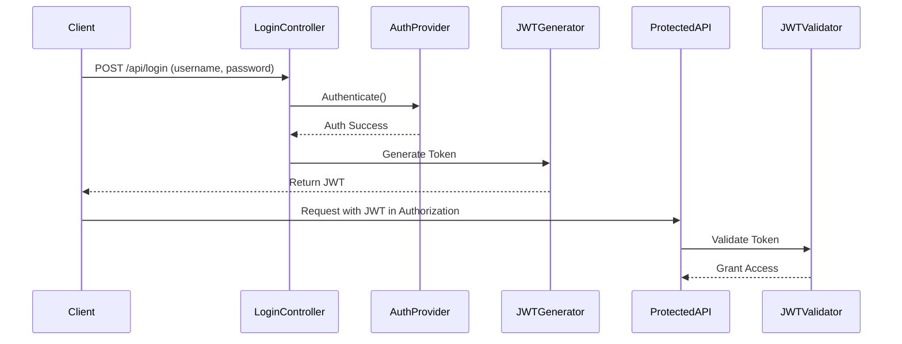

# 🔐 Employee Leave Management System (ELMS)


> A secure, stateless backend application for managing employee leave requests with **Spring Boot**, **JWT-based authentication**, and **custom login mechanism**. Designed for real-world scalability and clean architecture under the banner of **[Hexvoid](https://github.com/mHexVoid)**.

---

## 📚 Table of Contents

- [🚀 Overview](#-overview)
- [🎯 Features](#-features)
- [🏗️ Architecture](#-architecture)
- [🔐 Security Design](#-security-design)
- [🧪 Custom Login Flow Diagram](#-custom-login-flow)
- [🧩 Key Modules](#-key-modules)
- [📬 REST API Endpoints](#-rest-api-endpoints)
- [⚙️ Technologies Used](#-technologies-used)
- [🛠️ How to Run](#-how-to-run)
- [🔍 API Exploration (Swagger)](#-api-exploration-swagger)
- [🧠 Design Patterns](#-design-patterns)
- [📚 References](#-references)
- [🙌 Acknowledgements](#-acknowledgements)

---

## 🚀 Overview

The **Employee Leave Management System (ELMS)** is a backend service to manage employee leave requests with role-based access control. It uses **JWT tokens** for stateless security and a **custom login endpoint** instead of Spring's default form login.

- 🧍 Employees can apply for, view, and cancel leave requests.
- 👨‍💼 Admins can approve/reject leave requests.
- 💡 Clean separation of concerns across layers (Controller, Service, DAO, Entity).

---

## 🎯 Features

✅ Custom manual login (`/api/login`)  
✅ JWT generation & validation (no session/state)  
✅ Role-based access control (`EMPLOYEE`, `ADMIN`)  
✅ Leave request approval workflow  
✅ Clean, layered backend structure  
✅ Custom exception handling & filters  
✅ Java 17 + Spring Boot 3.x compatible

---

## 🏗️ Architecture

```
Presentation Layer (Controllers)
        ↓
Business Layer (Services)
        ↓
Data Access Layer (Repositories)
        ↓
Database (MySQL)
```

- Follows **layered architecture** and **loose coupling** principles.
- Role-based access is enforced via **Spring Security + JWT**.

---

## 🔐 Security Design

- Custom `/api/login` endpoint handles login with username/password.
- Uses **`UsernamePasswordAuthenticationToken`** and a custom provider.
- On successful auth:
  - A **JWT token** is generated and returned.
- All protected endpoints validate JWTs using a filter chain.

> 🧪 Fully custom authentication setup, no reliance on Spring login form.

---

## 🧪 Custom Login Flow

### 🔁 Flow Diagram



---

## 🧩 Key Modules

| Package                        | Description                                           |
|-------------------------------|-------------------------------------------------------|
| `controller`                  | REST APIs for login, employees, and leave             |
| `entity`                      | JPA entities (Employee, LeaveRequest, Role, etc.)     |
| `security`                    | Custom security config, filters, and provider         |
| `filter`                      | JWT token generation and validation filters           |
| `service`                     | Business logic for authentication and leave flow      |
| `dao`                         | Repository interfaces (Spring Data JPA)               |
| `exceptionhandler`            | Global error handling                                 |

---

## 📬 REST API Endpoints

### 🔐 Auth

| Method | Endpoint       | Description                        |
|--------|----------------|------------------------------------|
| POST   | `/api/login`   | Custom login, returns JWT token    |

### 👤 Employee Management

| Method | Endpoint               | Description                |
|--------|------------------------|----------------------------|
| POST   | `/api/employees`       | Create new employee        |
| GET    | `/api/employees`       | Get all employees          |
| GET    | `/api/employees/{id}`  | Get employee by ID         |
| PUT    | `/api/employees/{id}`  | Update employee            |
| DELETE | `/api/employees/{id}`  | Delete employee            |

### 📝 Leave Requests

| Method | Endpoint              | Description                        |
|--------|-----------------------|------------------------------------|
| POST   | `/api/leaves`         | Apply for leave                    |
| GET    | `/api/leaves`         | View all leave requests            |
| GET    | `/api/leaves/{id}`    | Get leave by ID                    |
| PUT    | `/api/leaves/{id}`    | Approve or reject leave (Admin)    |
| DELETE | `/api/leaves/{id}`    | Cancel pending leave (Employee)    |

---

## ⚙️ Technologies Used

- **Java 17**
- **Spring Boot 3.1+**
- **Spring Security**
- **JWT (io.jsonwebtoken)**
- **Maven**
- **MySQL**
- **Postman (Testing)**

---

## 🛠️ How to Run

1. Clone the project:
```bash
git clone https://github.com/mHexVoid/elms-springboot-security-sandbox.git
cd elms-springboot-security-sandbox
```

2. Update `application.properties` with your DB and secret config.

3. Run the project:
```bash
./mvnw spring-boot:run
```

4. Test with Postman or Swagger.

---


## 🔍 API Exploration (Swagger)

You can access Swagger UI to test and explore endpoints:

🌐 [http://localhost:8080/swagger-ui/index.html](http://localhost:8080/swagger-ui/index.html)

---

## 🧠 Design Patterns

- 🧠**Strategy Pattern** for pluggable authentication logic
- 🏗️**Builder Pattern** (DTOs No Implemention Currently)
- 🏭**Factory Pattern** (Filter Chains)
- 🧩**Layered Architecture**: Clear separation of concerns
- 🔄**Loose Coupling**: Interfaces and abstraction

---

## 📚 References

- 📘 [Spring Boot Official Docs](https://spring.io/projects/spring-boot)
- 🔐 [Spring Security](https://spring.io/projects/spring-security)
- 🔑 [JWT.io](https://jwt.io/)
- 🧾 [JWT.IO Intro](https://jwt.io/introduction)
- 🧪 [OpenAPI Swagger Docs](https://swagger.io/tools/swagger-ui/)
- 🛠️ [Spring Boot + JWT Tutorial](https://www.baeldung.com/spring-security-oauth-jwt)


## 🙌 Acknowledgements

- Inspired by real-world security architecture & modular design principles  
- Built with a strong focus on 🔐 **Security**, ⚙️ **Modularity**, and 🧼 **Clean Code**

---

## 👨‍💻 About Me

- 🧑‍💻 GitHub: [@mHexVoid](https://github.com/mHexVoid)  
- 🌐 Project Repo: [ELMS - Spring Security Sandbox](https://github.com/mHexVoid/elms-springboot-security-sandbox.git)  
- 💼 LinkedIn: [Gaurav Mishra](https://www.linkedin.com/in/gaurav-mishra-401a8a149/)

---

<p align="center">
  🚀 Built with ❤️ by <strong><a href="https://github.com/mHexVoid">Hexvoid</a></strong><br/>
  Part of the ✨ <strong>Hexvoid Initiative</strong> ✨
</p>
