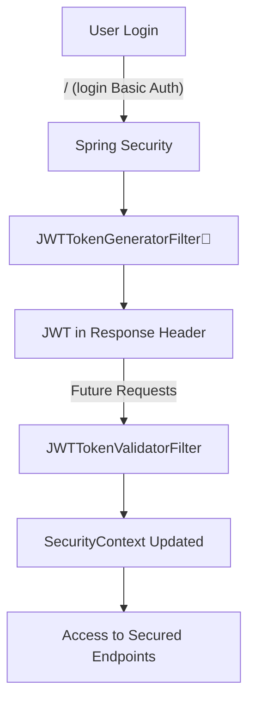

# 🔐 Employee Leave Management System (ELMS) with Spring Boot & JWT


> 🏷️ Built with ❤️ under the **Hexvoid** banner for clean, secure, and modular backend architecture.

---

## 📋 Table of Contents
- [🧠 Project Overview](#-project-overview)
- [🎯 Core Features](#-core-features)
- [📁 Project Structure](#-project-structure)
- [🔐 JWT Filter Flow](#-jwt-filter-flow)
- [🔍 Key Security Classes](#-key-security-classes)
- [🔄 API Endpoints](#-api-endpoints)
- [📦 Sample API Usage](#-sample-api-usage)
- [⚙️ Environment Variables](#-environment-variables)
- [🧱 DAO Layer](#-dao-layer)
- [🔐 Authentication Workflow](#-authentication-workflow)
- [⚙️ Tech Stack](#-tech-stack)
- [🧠 Design Notes](#-design-notes)
- [🏁 How to Run](#-how-to-run)
- [👨‍💻 Author](#-author)
- [🌱 Future Enhancements](#-future-enhancements)
- [📝 References](#-references)

---

## 🧠 Project Overview

The **Employee Leave Management System (ELMS)** is a real-world backend solution built using **Spring Boot**, secured by **JWT-based authentication** and **custom Spring Security configuration**. It allows employees to apply for leave and administrators to manage leave requests with strict role-based access control.

---

## 🎯 Core Features

- ✅ Custom JWT Authentication & Token Generation
- 🔒 Stateless Security (No Session Storage)
- 👥 Role-Based Access Control (`EMPLOYEE`, `ADMIN`)
- 🔑 BCrypt Password Encryption
- 🧩 Modular Structure (Controller, DAO, Filter, Security, Services)
- 🔄 Secure `/login`, `/user/details`, and role-specific leave endpoints

---

## 📁 Project Structure

```
src/
└── main/
    └── java/
        └── com/
            └── hexvoid/
                └── employeeportal/
                    ├── constants
                    ├── controller
                    ├── dao
                    ├── entity
                    ├── event
                    ├── exceptionhandler
                    ├── filter
                    ├── security
                    └── service
```

---

## 🔐 JWT Filter Flow



---

## 🔍 Key Security Classes

### 🔑 `JWTTokenGeneratorFilter`
- Runs after authentication success.
- Creates JWT from user info and sets it in response header.

### 🔎 `JWTTokenValidatorFilter`
- Intercepts incoming requests.
- Validates token from header and sets authentication in `SecurityContextHolder`.

### 🧰 `SpringSecurityConfig`
- Stateless session policy with granular endpoint security.
- CSRF disabled for APIs.
- Custom filter chain | Custom filters:
  - `RequestValidationBeforeFilter`
  - `AuthoritiesLoggingAtFilter`
  - `AuthoritiesLoggingAfterFilter`
  - `JWTTokenGeneratorFilter`
  - `JWTTokenValidatorFilter`


---

## 🔄 API Endpoints

### 🟢 Public Endpoints

| Method | Endpoint                  | Description              |
|--------|---------------------------|--------------------------|
| POST   | `/register/user`          | Register a new user      |
| GET    | `/user/details`           | Fetch logged-in user     |

### 🔐 Secured Endpoints

| Method | Endpoint                   | Required Role     |
|--------|----------------------------|--------------------|
| POST   | `/employee/apply-leave`    | EMPLOYEE           |
| GET    | `/admin/leave-requests`    | ADMIN              |

> JWT token must be passed in the header as `jwt-token`.

---

## 📦 Sample API Usage

### 🧾 Register a User :

**Endpoint:** `POST /register/user`

**Request Body**

```json
{
  "email": "user@example.com",
  "password": "secure123",
  "role": "EMPLOYEE"
}
```

### 🔑 Login (Basic Auth Header) and Get JWT Token
```http
GET /user/details HTTP/1.1
Authorization: Basic base64(email:password)
```
_Response includes `jwt-token` in header_

### 🛂 Use JWT for Authorization in Future Request
```http
GET /admin/leave-requests HTTP/1.1
jwt-token: eyJhbGciOiJIUzI1NiIsInR5cCI6IkpXVC...
```

---

## ⚙️ Environment Variables

These are configured via Spring Profiles or application.properties.

| Key                      | Description                    |
|--------------------------|--------------------------------|
| `jwt.secretKey`          | Primary secret key for JWT     |
| `jwt.defaultSecretKey`   | Fallback key if secret missing |
| `jwt.headerName`         | Header name (e.g., `jwt-token`) |

---

## 🧱 DAO Layer

| DAO Class               | Type          | Purpose                        |
|-------------------------|---------------|--------------------------------|
| `EmployeeCredentialsDao` | JpaRepository | Basic credential queries       |
| `EmployeeDAO`            | Custom DAO    | Manual Employee DB ops         |
| `LeaveRequestDAO`        | Custom DAO    | Manual Leave ops (EntityMgr)   |

---

## 🔐 Authentication Workflow

1. User logs in using `/user/details` with Basic Auth.
2. On successful authentication, `JWTTokenGeneratorFilter` generates and sends a JWT.
3. Future requests must send this JWT in the header (`jwt-token`).
4. `JWTTokenValidatorFilter` validates it and sets authentication in context.

---

## ⚙️ Tech Stack

- Java 17
- Spring Boot 3.x
- Spring Security
- JSON Web Token (JWT)
- H2 / MySQL
- Maven

---


## 🧠 Design Notes

- Stateless architecture → easier horizontal scaling.
- Passwords hashed using BCrypt (via DelegatingPasswordEncoder).
- Exception-safe filter logic (`BadCredentialsException` on token failure).
- Custom user-authentication provider (`EmployeeUserNamePwdAuthenticationProvider`).

---

## 🏁 How to Run

```bash
git clone https://github.com/mHexVoid/elms-springboot-security-sandbox.git
cd elms-spring-jwt
```

1. Configure database & JWT properties in `application.properties`
2. Run with:
```bash
./mvnw spring-boot:run
```
3. Test using Postman / Swagger

---

## 🌐 Access Swagger UI

Once the app is running, open  
- [🔗 Swagger UI](http://localhost:8080/swagger-ui/index.html) in your browser to explore available APIs.

---

## 👨‍💻 Author

**Gaurav Mishra**  
Crafting secure & scalable Spring Boot apps ☕💻   
[💼 LinkedIn](https://www.linkedin.com/in/gaurav-mishra-401a8a149/) &nbsp;&nbsp;|&nbsp;&nbsp; [💻 GitHub](https://github.com/mHexVoid)
&nbsp;&nbsp;|&nbsp;&nbsp; [🌐 Project Repo](https://github.com/mHexVoid/elms-springboot-security-sandbox.git)
> Got ideas, feedback, or looking to collaborate?  
> Open an issue or drop a PR — let’s build something awesome together.

---

## 🌱 Future Enhancements

- 📘 Swagger UI integration
- 🐳 Docker support
- 📁 Environment-specific configs
- 🧪 Unit & Integration Testing

---

## 📝 References

- 📘 [Spring Security Docs](https://docs.spring.io/spring-security/site/docs/current/reference/html5/)  
  Official documentation for securing Java applications using Spring Security.

- 🧑‍💻 [Spring Security Custom Filters](https://www.baeldung.com/spring-security/custom-filters)  
  A practical guide on creating and using custom filters in Spring Security. This directly applies to the custom filters you created in your project (e.g., `RequestValidationBeforeFilter`, `AuthoritiesLoggingAtFilter`, `AuthoritiesLoggingAfterFilter`).

- 🚀 [Spring Boot Security](https://docs.spring.io/spring-boot/docs/current/reference/htmlsingle/#boot-features-security)  
  The official documentation for integrating Spring Security with Spring Boot, which is key for your project’s setup and configuration.

- 📊 [Spring Security Event Publishing & Listeners](https://www.baeldung.com/spring-security-events)  
  Since your project involves logging authentication events (like logging successful logins and authorization failures), this tutorial would be extremely relevant to your event logging and listener setup.

- 🧰 [SpringDoc OpenAPI](https://springdoc.org/)  
  You’re using Swagger UI for API documentation, so this is relevant for setting up and customizing your Swagger integration within the Spring Boot application.

- 🔐 [Spring Security JWT Authentication](https://www.baeldung.com/spring-security-jwt)  
  This resource would be useful if you want to further enhance security with JWT-based authentication.


---
> 💡 Feel free to fork, extend, or raise a PR. Collaboration welcome!

---

<p align="center">
  🚀 Built with ❤️ by <strong><a href="https://github.com/mHexVoid">Hexvoid</a></strong> — Part of the ✨ <strong>Hexvoid Initiative</strong> ✨
</p>